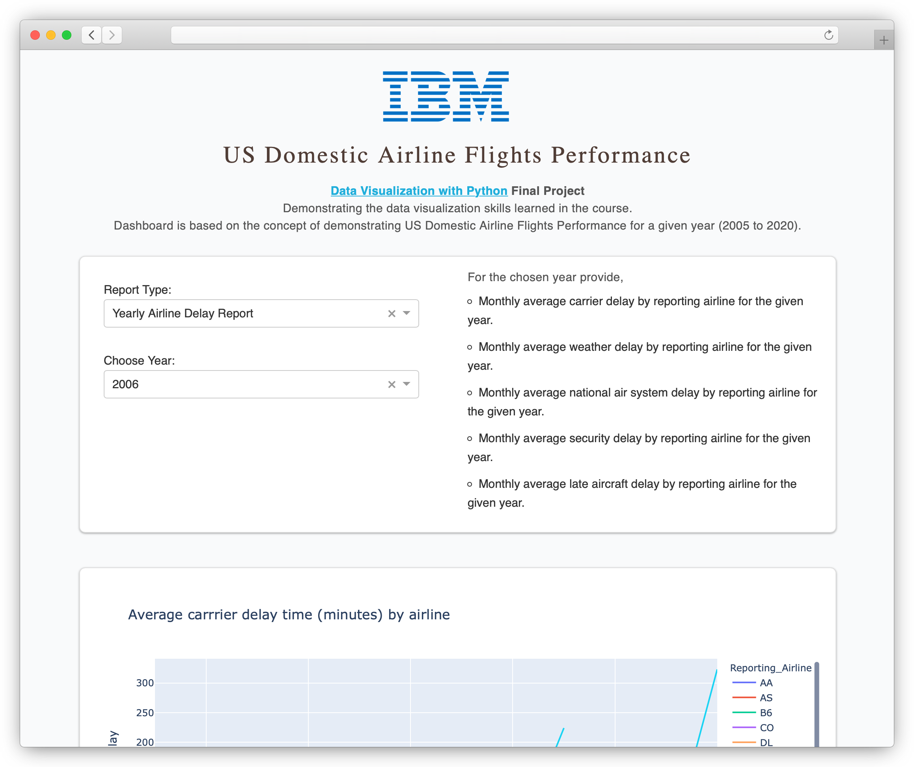

# US Domestic Airline Flights Performance

This repository contains only the beautified version of the final assignment found on [this course](https://www.coursera.org/learn/python-for-data-visualization). The ideas, contents and, resources are not owned particularly by me, please use this repository wisely.

With that said, you can still play along with [the live demo](https://us-dafp.herokuapp.com/) served on Heroku. Please be advised that sometimes the server may take sometime to restart as I am not purchasing any plans.

Please feel free to send pull requests or simply raise issues if you find anything incorrect or misleading. Thanks.